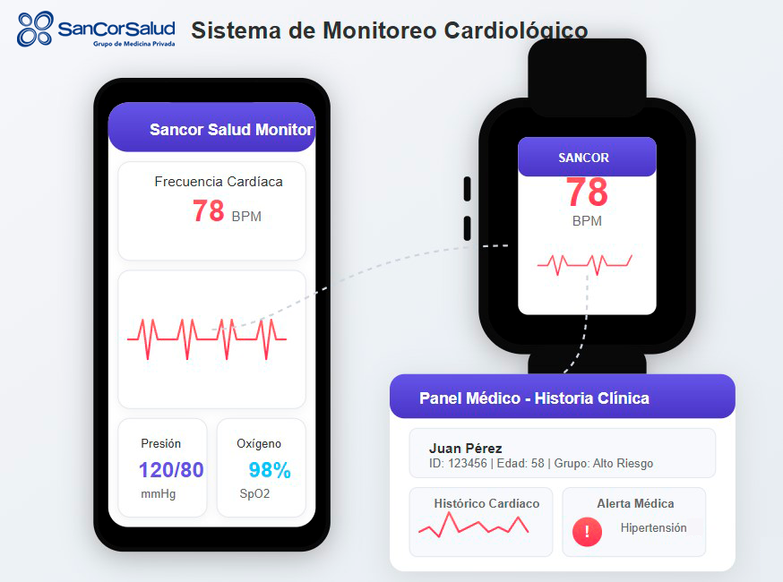

# Plan de Sistemas de Información - Sancor Salud

## Descripción General

Este repositorio contiene la documentación completa del Plan de Sistemas de Información para Sancor Salud (Medicina Prepaga), desarrollado como trabajo práctico para la asignatura "Gestión de Sistemas de Información" de la Universidad de la Ciudad de Buenos Aires.

El trabajo presenta un análisis integral de la organización, el rol actual de Sistemas de Información y una propuesta de tres proyectos estratégicos que permitirán a Sancor Salud avanzar en su transformación digital, mejorar la experiencia de sus afiliados y optimizar sus procesos internos.

## Estructura del Repositorio

- **[Hito 1: Drivers de Negocio](./hito1-markdown.md)** - Análisis de la empresa, FODA y contexto organizacional
- **[Hito 1](./hito1-rc.md)** - Actualización pendiente de aprobar
- **[Hito 2: Rol de Sistemas de Información](./hito2-markdown.md)** - Análisis del área de Sistemas y su rol actual
- **[Hito 3: Proyectos Estratégicos](./hito3-markdown.md)** - Descripción detallada de los tres proyectos propuestos
- **[Presupuesto Detallado](./presupuesto-markdown.md)** - Desglose de CAPEX/OPEX para cada proyecto
- **[Cronograma de Implementación](./cronograma-markdown.md)** - Planificación temporal de los proyectos
  
## Listado de Clases ASIG00120 - Gestión de Sistemas de Información subidas a Youtube

- **[17-03-2024: Clase 1](./docs/Clase_1_Gestion_de_Sistemas_de_Informacion.pdf)** - 
 

## Guiones para Presentaciones

- **[Guion Hito 1](presentaciones/presentacion-hito1.md)** - Guión para video de Drivers de Negocio (2 minutos)
- **[Guion Hito 2](presentaciones/presentacion-hito2.md)** - Guión para video de Rol de Sistemas (2 minutos)
- **[Guion Hito 3](presentaciones/presentacion-hito3.md)** - Guión para video de Proyectos Estratégicos (6 minutos)

## Proyectos Propuestos

### 1. Sistema de Monitoreo Cardiológico con Wearables

- Implementación de pulseras inteligentes para monitoreo de parámetros cardíacos (frecuencia, presión)
- Integración con historia clínica electrónica
- Detección temprana de riesgos cardiovasculares

---

### 2. Portal Digital de Autogestión para Afiliados

- Portal web responsive y app móvil para autogestión
- Funcionalidades: credencial digital, autorizaciones, reintegros, cartilla
- Reducción de trámites presenciales y mejora de experiencia del afiliado

---

### 3. Sistema de Análisis Predictivo para Gestión de Riesgos

- Implementación de modelos predictivos para identificar afiliados con riesgo
- Intervención preventiva temprana
- Mejor asignación de recursos médicos

## Información del Curso

- **Asignatura:** Gestión de Sistemas de Información
- **Universidad:** Universidad de la Ciudad de Buenos Aires
- **Cuatrimestre:** 1er cuatrimestre 2025
- **Grupo:** 12 (Salud)
- **Profesores:** Ricardo Stroia, Facundo Triay, Pablo Roitman

## Autores

- TAMARA CABRAL
- VANESA DALUICIS
- WALTER DENIS GOMEZ
- FERNANDO DANIEL OSABA
- JULIETA SDRUBOLINI
- CARLOS FACUNDO TELLO

## Licencia

Este trabajo es presentado con fines académicos y no debe utilizarse para implementación real sin la debida adaptación y validación profesional.
