# HITO 1: DRIVERS DE NEGOCIO

## Sancor Salud - Medicina Prepaga

### Perfil de la Empresa

**Nombre:** Sancor Salud  
**Sector:** Salud (Medicina Prepaga)  
**Empleados:** 250 (15 en el área de sistemas)

### Presentación de la empresa

SanCor Salud, es un grupo empresario de medicina prepaga de capital nacional. Se presenta como líder en calidad de servicio. Asume el compromiso de brindarle a la sociedad un servicio de salud diferencial que cuide a las familias argentinas en los momentos más importantes de sus vidas. 
Cuenta con más de 300 puntos de atención en todo el país y una red de profesionales conformada por más de 200.000 prestadores, con 700.000 personas y más de 3.500 empresas clientes. 

### Misión

Brindar servicios de salud de calidad, accesibles y centrados en la persona, promoviendo la prevención y el cuidado integral de nuestros afiliados.

### Visión

Ser la prepaga líder en innovación y calidad asistencial, reconocida por su enfoque preventivo y personalizado en el cuidado de la salud de los argentinos.

### Valores

- Compromiso con la salud
- Calidad asistencial
- Innovación constante
- Transparencia
- Accesibilidad
- Prevención y educación para la salud

## Análisis FODA de la Empresa

### Fortalezas

- Amplia red de prestadores médicos en todo el país
- Marca reconocida y confiable en el mercado de la salud
- Diversidad de planes para diferentes segmentos de clientes
- Solidez financiera y respaldo del Grupo Sancor
- Equipo médico y de gestión con alta experiencia en el sector

### Debilidades

- Sistemas de gestión de afiliados parcialmente digitalizados
- Baja integración de datos entre prestadores y la prepaga
- Procesos administrativos de autorizaciones lentos y burocráticos
- Poca diferenciación tecnológica respecto a competidores
- Limitada capacidad de análisis preventivo de riesgos de salud

### Oportunidades

- Creciente interés por planes con enfoque preventivo
- Tendencia hacia la digitalización de servicios de salud
- Mercado potencial en segmentos jóvenes y tecnológicos
- Expansión geográfica a regiones menos atendidas
- Integración de tecnologías wearables para monitoreo de salud

### Amenazas

- Alta competencia en el sector de medicina prepaga
- Inflación y aumento de costos médicos
- Cambios regulatorios en el sistema de salud argentino
- Presión para incluir nuevas coberturas sin aumentar precios
- Riesgo de ciberataques y vulnerabilidades en datos sensibles

## Contexto Organizacional y Estratégico

Sancor Salud opera en un contexto de **expansión**, buscando fortalecer su posición en el mercado a través de mayor cobertura geográfica y diferenciación mediante servicios digitales innovadores. La organización enfrenta el desafío de mantenerse competitiva en un entorno donde la tecnología se ha convertido en un elemento crítico para ofrecer servicios de salud eficientes y personalizados.

La empresa necesita transformar sus procesos y sistemas de información para capitalizar las oportunidades del mercado y responder a las crecientes expectativas de sus afiliados, quienes demandan mayor agilidad, personalización y acceso digital. Los sistemas de información juegan un papel esencial para integrar los componentes de la cadena de valor, facilitar una respuesta ágil ante los cambios del entorno y generar información crítica para la toma de decisiones estratégicas.

## Organigrama General

```
Director General
│
├── Gerencia Médica
│   ├── Subgerencia de Prestadores Médicos
│   └── Subgerencia de Auditoría Médica
│
├── Gerencia Comercial
│   ├── Subgerencia de Ventas
│   └── Subgerencia de Marketing
│
├── Gerencia de Operaciones
│   ├── Subgerencia de Atención al Afiliado
│   └── Subgerencia de Autorizaciones
│
├── Gerencia de Finanzas
│   ├── Subgerencia de Contabilidad
│   └── Subgerencia de Cobranzas
│
├── Gerencia de Recursos Humanos
│
└── Gerencia de Sistemas de Información
```




```mermaid
flowchart TD
    DG[Director General] --> GM[Gerencia Médica]
    DG --> GC[Gerencia Comercial]
    DG --> GO[Gerencia de Operaciones]
    DG --> GF[Gerencia de Finanzas]
    DG --> GRRHH[Gerencia de Recursos Humanos]
    DG --> GSI[Gerencia de Sistemas de Información]
    
    GM --> SPM[Subgerencia de Prestadores Médicos]
    GM --> SAM[Subgerencia de Auditoría Médica]
    
    GC --> SV[Subgerencia de Ventas]
    GC --> SM[Subgerencia de Marketing]
    
    GO --> SAA[Subgerencia de Atención al Afiliado]
    GO --> SA[Subgerencia de Autorizaciones]
    
    GF --> SC[Subgerencia de Contabilidad]
    GF --> SCO[Subgerencia de Cobranzas]

    style DG fill:#4285f4,stroke:#2255aa,color:white
    style GM fill:#4285f4,stroke:#2255aa,color:white
    style GC fill:#4285f4,stroke:#2255aa,color:white
    style GO fill:#4285f4,stroke:#2255aa,color:white
    style GF fill:#4285f4,stroke:#2255aa,color:white
    style GRRHH fill:#4285f4,stroke:#2255aa,color:white
    style GSI fill:#4285f4,stroke:#2255aa,color:white
    
    style SPM fill:#34a853,stroke:#227733,color:white
    style SAM fill:#34a853,stroke:#227733,color:white
    style SV fill:#34a853,stroke:#227733,color:white
    style SM fill:#34a853,stroke:#227733,color:white
    style SAA fill:#34a853,stroke:#227733,color:white
    style SA fill:#34a853,stroke:#227733,color:white
    style SC fill:#34a853,stroke:#227733,color:white
    style SCO fill:#34a853,stroke:#227733,color:white
```

Esta estructura organizacional refleja un modelo funcional donde la Gerencia de Sistemas de Información está posicionada al mismo nivel que las demás áreas clave, lo que facilita la integración de tecnología en los procesos de negocio y la comunicación horizontal entre departamentos. Este posicionamiento es fundamental para que el área de sistemas pueda contribuir significativamente a la estrategia organizacional y no limitarse a un rol meramente técnico o de soporte.
