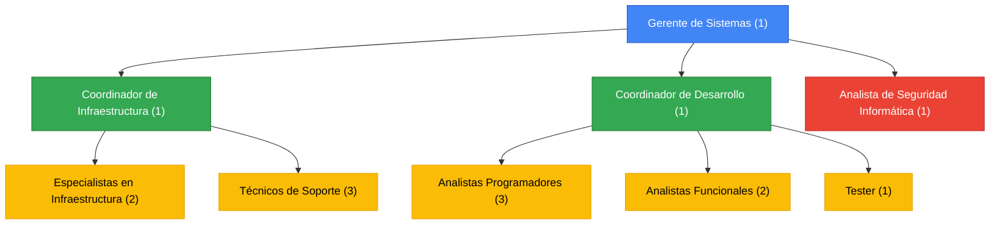

# HITO 2: ROL DE SISTEMAS DE INFORMACIÓN

## Rol de Sistemas dentro de la Organización

Sistemas de Información en Sancor Salud actualmente ocupa un rol de **acompañamiento y ejecución**, con la visión de transformarse en un **socio estratégico** del negocio. Este rol está alineado con la evolución que han tenido los sistemas de información empresariales, que han pasado de ser herramientas operativas a convertirse en facilitadores de la estrategia organizacional y generadores de ventaja competitiva.

### Funciones Actuales

- Mantener los sistemas administrativos y operativos
- Gestionar la infraestructura tecnológica y redes
- Desarrollar e implementar mejoras a los sistemas existentes
- Brindar soporte técnico a todas las áreas
- Apoyar iniciativas de transformación digital iniciadas por otras áreas

### Justificación del Rol

El área de Sistemas en Sancor Salud ha evolucionado en los últimos años desde un rol puramente de soporte hacia un papel más activo en la ejecución de iniciativas estratégicas. Sin embargo, aún no alcanza el nivel de socio estratégico debido a:

1. Las principales decisiones tecnológicas aún se originan en otras áreas
2. El presupuesto asignado está más orientado al mantenimiento que a la innovación
3. El CIO no participa regularmente en las decisiones estratégicas de alto nivel
4. Los proyectos de transformación digital no suelen ser liderados por Sistemas

## Análisis FODA de Sistemas

### Fortalezas

- Sistema de gestión de afiliados estable y confiable
- Equipo técnico con buen conocimiento del negocio
- Infraestructura de servidores y redes robusta
- Experiencia en integración con prestadores médicos
- Buen nivel de servicio en soporte técnico

### Debilidades

- Presupuesto limitado para proyectos de innovación
- Sistemas legacy difíciles de modificar
- Equipo pequeño para la demanda de proyectos
- Falta de especialistas en tecnologías emergentes (IoT, IA)
- Procesos de desarrollo poco ágiles

### Oportunidades

- Implementación de soluciones móviles para afiliados
- Uso de wearables y dispositivos IoT para monitoreo de salud
- Automatización de procesos de autorizaciones médicas
- Desarrollo de herramientas de análisis predictivo para prevención
- Migración gradual a arquitecturas cloud

### Amenazas

- Crecientes exigencias regulatorias en protección de datos médicos
- Dificultad para reclutar y retener talento tecnológico
- Riesgo de obsolescencia tecnológica
- Aumento de sofisticación en ciberataques
- Expectativas crecientes de los usuarios en experiencia digital

## Transición hacia un Rol Estratégico

Para que Sistemas de Información en Sancor Salud evolucione hacia un rol de socio estratégico, es necesario enfocarse en cómo la tecnología puede transformar los procesos de negocio y crear valor para la organización. Esta transición requiere:

1. **Alineación estratégica**: Vincular las iniciativas de TI con los objetivos estratégicos de la empresa
2. **Gestión de valor**: Demostrar el impacto de las inversiones en TI en términos de valor para el negocio
3. **Gestión de recursos**: Optimizar la infraestructura de TI y las capacidades del personal
4. **Gestión de riesgos**: Abordar proactivamente los riesgos asociados con la implementación de tecnología

Los proyectos propuestos en el Hito 3 están diseñados para catalizar esta transición, permitiendo que el área de sistemas se posicione como un agente de cambio y generador de valor.

## Organigrama de Sistemas (15 personas)

```
Gerente de Sistemas (1)
│
├── Coordinador de Infraestructura (1)
│   ├── Especialistas en Infraestructura (2)
│   └── Técnicos de Soporte (3)
│
├── Coordinador de Desarrollo (1)
│   ├── Analistas Programadores (3)
│   ├── Analistas Funcionales (2)
│   └── Tester (1)
│
└── Analista de Seguridad Informática (1)
```



### Distribución de Personal por Rol

| Rol | Cantidad |
|-----|----------|
| Gerencia | 1 |
| Coordinación | 2 |
| Especialistas en Infraestructura | 2 |
| Técnicos de Soporte | 3 |
| Analistas Programadores | 3 |
| Analistas Funcionales | 2 |
| Tester | 1 |
| Analista de Seguridad | 1 |
| **Total** | **15** |

Esta estructura refleja una organización típica para una empresa de este tamaño, con una clara división entre las funciones de infraestructura y desarrollo. Sin embargo, para afrontar los proyectos de transformación propuestos, será necesario complementar estas capacidades con roles especializados en análisis de datos, experiencia de usuario y gestión de proyectos digitales.
